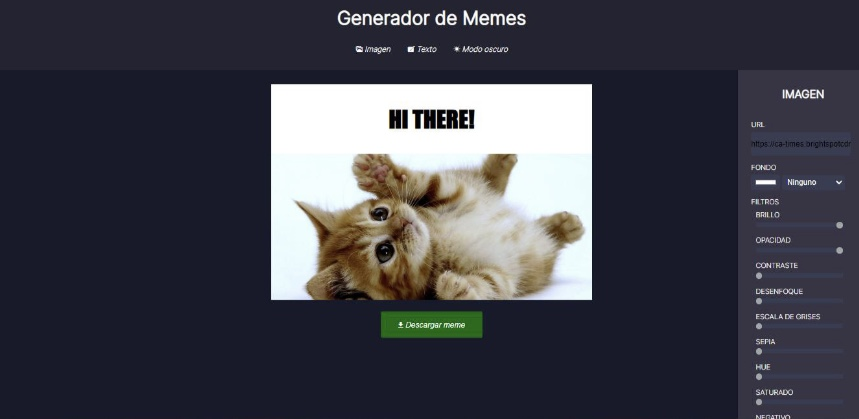

# Meme generator 🚀

***

### Meme generator developed as part of my studies as a Front-End Developer

#### With this app you will be able to create memes for free choosing and modifying images, text and colors you like the most and share them in other sites. Have fun!

***

## Technologies 🖥️

1. HTML5
2. CSS3
3. JavaScript
4. Git
5. GitHub

***

## Preview

## Watch my project 🤓

1. [GitHub](https://github.com/sofiariadna/Proyecto-Editor-de-Memes)
2. [GitHub Pages](https://sofiariadna.github.io/Proyecto-Editor-de-Memes/)

